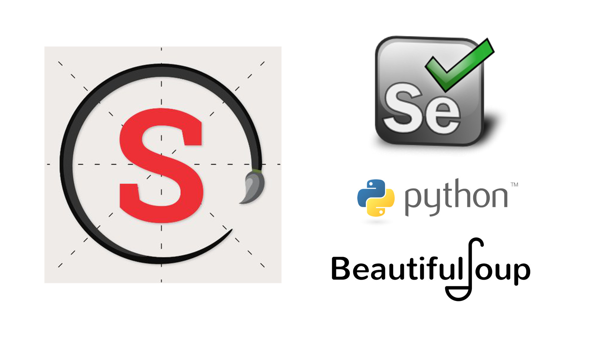

[comment]: # (Skritter logo https://pbs.twimg.com/profile_images/996289862788562944/ICJQEIp8_400x400.jpg)

[comment]: # (Selenium logo https://selenium-python.readthedocs.io/_static/logo.png)

[comment]: # (Python logo http://pluspng.com/img-png/python-logo-png-png-format-flattened-601.png)

[comment]: # (BS4 logo https://funthon.wordpress.com/2017/05/21/beautiful-soup-4/)

# Skritter Vocabulary Lists

# Introduction

[Skritter](https://skritter.com/) is a very sophisticated piece of software which can be used to learn both Chinese and Japanese. It is a spaced repetition software which allows one to learn Chinese and Japanese characters at the stroke level. It is more advanced than say Anki, but it requires a subscription to use it. Skritter has a number of useful vocabulary lists on their website including many popular textbooks. Many of these lists are available elsewhere on the internet, but some can be difficult to locate. It is possible to export these lists from Skritter, but this is cumbersome if you want more than one list.

This notebook is a relatively simple notebook written to practice web scraping using Selenium. It will log in to your Skritter account and scrape vocabulary lists. In order to get these lists you will need to sign up for an account with Skritter. The purpose of this script is to make life a little easier for Chinese and Japanese language learners. This notebook will scrape vocabulary lists into csv files and produce a description of each list in a markdown file. However, there is no audio scraped or character stroke information from Skritter to accompany these lists. The format of the csv files makes it easy to use with other software such as Anki. The format for the columns is

  1. Simplified Chinese
  2. Traditional Chinese if different from simplified Chinese, otherwise it is just a dash (-)
  3. Pinyin
  4. English
  5. Tag (Section)

Certainly, one could of accomplished the same task by copying, pasting and editing or using the export features available on Skritter to reach the same outcome, but the by using Selenium to automate this task makes life a whole lot easier, especially if you decide you want more than one vocabulary list.

I wrote this to obtain a few of the Chinese lists, but this notebook will also get Japanese lists too, if desired. However, please note that if you are getting Japanese lists there are still 5 columns in the csv files

  1. Writing = Kanji/Hiragana/Katakana
  2. Writing enabled = Who knows? This is still scraped and put into the csv files. Easily removed if desired.
  3. Reading = Hiragana/Katakana
  4. Definition = English
  5. Tag (Section)

The functions are rather simple and could possibly be improved upon. Also note that there is only minimal error handling included here. A good webscraper should of course try to anticipate as many errors possible.

# References

  1. Ryan Mitchell, Web Scraping with Python, 2nd Edition Collecting More Data from the Modern Web, O'Reilly Media.

  2. Python documentation, <https://www.python.org/doc/>

  3. Selenium documentation, <https://selenium-python.readthedocs.io/api.html#module-selenium.webdriver.chrome.webdriver>

  4. BeautifulSoup documentation, <https://www.crummy.com/software/BeautifulSoup/bs4/doc/>

  5. Skritter <https://skritter.com/>
